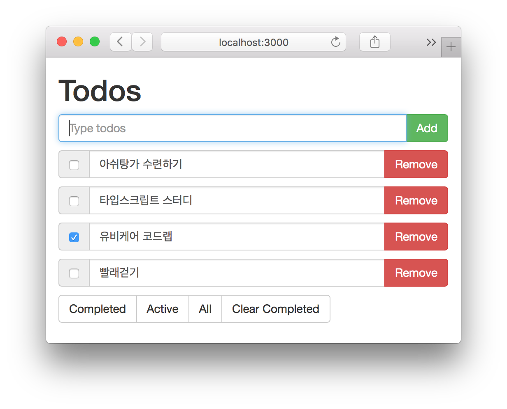

todomvc-angular
===============

## 미리보기

이번 강의에서 만들 결과물을 미리 보자.

* 투두(Todo) 목록을 조회
* 추가, 편집, 삭제, 완료 처리 (CRUD)
* 투두의 상태에 따라 completed(완료), active(진행중)로 필터링



## 프로젝트 구조

### 백엔드

* 서버는 [Node.js](https://nodejs.org/en/)기반의 [Express.js](http://expressjs.com) 웹프레임웍을 사용함
* 서버는 1) html, css, javascript 등의 정적 파일을 호스팅하고 2) ajax 기능을 수행할 api를 제공함  

### 프론트엔드

* 웹페이지는 [Angular.js](https://angularjs.org)를 사용한 하나의 페이지(index.html)로 구성됨
* 앵귤러 컨트롤러로 웹페이지를 조작하고 앵귤러 서비스를 통해 백엔드 api와 통신함


## 개발 환경

### Node.js

* [https://nodejs.org/en/](https://nodejs.org/en/)에서 다운로드 후 설치
* 웹서버 구동과 프로젝트 관리를 위해 사용

### NPM

* Node Package Manager
* 노드 패키지를 프로젝트에 추가, 삭제하거나 직접 작성한 패키지를 배포할 때 사용함.
* 본 프로젝트에서는 angularjs등 외부 라이브러리 설치시 사용
* 노드를 설치하면 자동으로 NPM도 설치됨
* *이후 Bower, Gulp 등 개발 툴은 상황에 따라 추가 설명할 예정*

## 프로젝트 초기화

* Npm으로 프로젝트 초기화

```
$ mkdir todomvc && cd todomvc
$ npm init
```

* package.json: 프로젝트 정보를 담고 있음.
* 특히 dependencies에는 프로젝트에서 사용하는 외부 라이브러리 정보가 기록됨

## 앵귤러 시작

* index.html 작성

```html
<!-- index.html -->
<!DOCTYPE html>
<html lang="en">
<head>
  <meta charset="UTF-8">
  <meta name="viewport"
        content="width=device-width, initial-scale=1, user-scalable=yes">
  <title>Angular | TodoMVC</title>
</head>
<body>
</body>
</html>
```

* Npm 으로 앵귤러 설치:

```
$ npm install angular --save
```
* save 옵션을 주는 것은 이 프로젝트가 앵귤러 라이브러리를 사용한다는 것을 알리는 것
* 이 정보는 package.json의 dependencies에 추가됨
* 앵귤러 라이브러리를 로딩하고 **모듈(module)**, **컨트롤러(controller)** 생성
* `ng-app`: 브라우져에게 앵귤러 모듈을 사용한다고 알림
* `ng-controller`: 브라우져에게 앵귤러 컨트롤러를 사용한다고 알림

```html
<!-- index.html -->
<html ng-app="todomvc">
  <body ng-controller="TodomvcCtrl">

  <script src="node_modules/angular/angular.js"></script>
  <script>
    angular
        .module('todomvc', [])
        .controller('TodomvcCtrl', function ($scope) {
          $scope.message = 'Hello wordl!';
        });
  </script>
  </body>
</html>
```

## [TIP] brower-sync

* [bower-sync](https://www.browsersync.io/)는 코드변호에 따라 브라우져를 리프레시 해주는 툴
* 내부적으로 웹서버를 구동함
* Npm을 이용해 글로벌로 설치

```
$ npm install -g browser-sync
$ browser-sync start --server --files "./**/*"
```

## Controller

* Html로 작성된 템플릿과 연결되어 데이터를 출력하고 사용자 입력을 처리하는 것이 컨트롤러의 역할
* `angular.module().controller()` 함수로 컨트롤러 정의

```javascript
// js/controllers/TodomvcCtrl.js:
angular.module('todomvc')
    .controller('TodomvcCtrl', function ($scope) {
      $scope.message = 'Hello world!';
    });
```

* 컨트롤러스  생성과 동시에 스코프 변수(`$scope`)가 자동으로 생성됨
* 이는 템플릿과 컨트롤러간의 연결을 위한 변수임
* index.html에 스코프 변수 출력하기 (인터폴레이션)

```html
<!-- index.html -->
<body ng-controller="TodomvcCtrl">
  <p>
    {{ message }} <!-- "Hello world!" -->
  </p>
</body>

```

## 투두 목록 출력하기 (ngRepeat)

* 컨트롤러에 배열 데이터 `$scope.todos` 만들기

```javascript
// js/controllers/TodomvcCtrl.js
angular.module('todomvc')
    .controller('TodomvcCtrl', function ($scope) {
      $scope.todos = [{
        id: 1,
        title: '요가 수행하기',
        completed: false
      }, {
        id: 2,
        title: '어머니 용돈 드리기',
        completed: true
      }];
    });
```

* `ngRepeat`으로 배열 출력하기

```html
<!-- index.html -->
<ul ng-repeat="todo in todos track by $index">
  <li>
      <input type="checkbox" ng-model="todo.completed">
      <input type="text" ng-model="todo.title">
      <button type="button">Remove</button>
  </li>
</ul>
```

## 삭제 기능 만들기 (ngClick)

* ngClick 디렉티브를 이용해 버튼의 클릭 이벤트 후킹

```html
<!-- index.html -->
<!-- ng-click 디렉티브로 컨트롤러의 remove() 함수와 연결했다. -->
<button type="button" ng-click="remove(todo.id)">Remove</button>
```

* ngClick에 설정한 컨트롤러 함수를 이용해 이벤트 핸들러 구현


```javascript
// js/controllers/TodomvcCtrl.js
angular.module('todomvc')
    .controller('TodomvcCtrl', function ($scope) {
      $scope.remove = function (id) {
        if (!id) return;

        // 배열에서 제거할 인덱스를 검색
        var deleltedTodoIdx = $scope.todos.findIndex(function (todo) {
          return todo.id === id;
        });

        if (deleltedTodoIdx === -1) return;

        // 배열에서 제거
        $scope.todos.splice(deleltedTodoIdx, 1);
      }

    });
```

## 새로운 투두 추가하기 (ngForm)

* 앵귤러로 폼 작성하기
* 폼에서 submit 이벤트 발생시 ngSubmit 디렉티브에 설정한 컨트롤러 함수가 동작하는 구조
* 폼버튼을 만들고 ngSubmit에 컨트롤러 함수를 연결

```html
<!-- index.html -->
<form ng-submit="add(newTodoTitle)">
  <input type="text" ng-model="newTodoTitle" placeholder="Type todos" autofocus>
  <button type="submit">Add</button>
</form>
```

* ngSumbit에 연결된 컨트롤러 함수 구현

```javascript
// js/controllers/TodomvcCtrl.js
angular.module('todomvc')
    .controller('TodomvcCtrl', function ($scope) {
      $scope.addTodo = function (title) {
        title = title.trim();
        if (!title) return;

        // 새로 추가할 아이디 계산
        var newId = !$scope.todos.length ?
            1 : $scope.todos[$scope.todos.length - 1].id + 1;

        // 새로운 투두 객체
        var newTodo = {
          id: newId,
          title: title,
          completed: false
        };

        // todos 배열에 새로운 투두 추가
        $scope.todos.push(newTodo);
      };
    });
```

## 스타일 입히기 (Twitter Bootstrap)

* [Twitter Bootstrap](http://getbootstrap.com)은 반응형웹, 모바일 웹을 위한 스타일시트 라이브러리
* Npm으로 부트스트랩 설치

```
$ npm instsall bootstrap --save
```
* index.html에 라이브러리 로딩

```html
<!-- index.html -->
<link rel="stylesheet" href="node_modules/bootstrap/dist/css/bootstrap.css">
```

* 부트스트랩 클래스 적용하기

```html
<!-- index.html -->
<!DOCTYPE html>
<html lang="en">
<head>
  <meta charset="UTF-8">
  <meta name="viewport"
        content="width=device-width, initial-scale=1, user-scalable=yes">
  <title>Angular | TodoMVC</title>
  <link rel="stylesheet"
        href="node_modules/bootstrap/dist/css/bootstrap.min.css">
</head>
<body ng-app="todomvc">
<div ng-controller="TodomvcCtrl" class="container">
  <h1>Todos</h1>

  <ul class="list-unstyled">
    <li>
      <form ng-submit="add(newTodoTitle)">
        <div class="input-group">
          <input type="text" ng-model="newTodoTitle" class="form-control"
                 placeholder="Type todos" autofocus>
          <span class="input-group-btn">
            <button class="btn btn-success" type="submit">Add</button>
          </span>
        </div>
      </form>
    </li>
  </ul>

  <ul ng-repeat="todo in todos" class="list-unstyled">
    <li>
      <div class="input-group">
        <span class="input-group-addon">
          <input type="checkbox" ng-model="todo.completed">
        </span>
        <input type="text" class="form-control" ng-model="todo.title">
        <div class="input-group-btn">
          <button class="btn btn-danger" ng-click="remove(todo.id)">Remove</button>
        </div>
      </div>
    </li>
  </ul>
</div>

<script src="node_modules/angular/angular.js"></script>
<script src="js/app.js"></script>
<script src="js/controllers/TodomvcCtrl.js"></script>

</body>
</html>
```

## 투두 목록 필터링 (ngRepeat filter)

* 출력된 투두목록을 다음 기준으로 필터링 해보자.
* __completed__: 완료된 투두 리스트, __active__: 미완료된 투두 리스트, __all__: 모든 투두 리스트
* ngRepeat의 필터링 기능을 이용
* filter에 필터 조건을을 넣음

```html
<!-- index.html -->
<ul ng-repeat="todo in todos | filter: {completed: true}">
```

* 필터 버튼을 만들어 ngClick 디렉티브에 필터 변수값을 변경하는 코드 작성

```html
<!-- index.html -->
<ul ng-repeat="todo in todos | filter:statusFilter">
<div class="btn-group" role="group" aria-label="...">
  <button type="button" ng-click="status={completed:true}">Completed</button>
  <button type="button" ng-click="status={completed:false}">Active</button>
  <button type="button" ng-click="status={}">All</button>
</div>
```

## [DIY] Clear All 버튼 만들기


## 디렉티브

* [디렉티브](https://docs.angularjs.org/guide/directive)는 특별한 역할을 하는 돔(DOM) 엘레먼트
* Jquery로 직접 돔을 조작하거나, 중복 코드를 리팩토링하거나, 새로운 마크업을 만들고 싶을때 사용함
* 하나의 투두를 표현하는 코드 덩어리를 디렉티브로 만들어 보자

```html
<!-- index.html -->
<ul ng-repeat="todo in todos | filter:status" class="list-unstyled">
  <li>
    <todo-item></todo-item>
  </li>
</ul>
```

* `angular.module().directive()` 함수로 todoItem 디렉티브 정의

```javascript
// js/directives/todoItem.js
angular.module('todomvc')
    .directive('todoItem', function () {
      return {
        restrict: 'E',
        template: '<div>todoItem</div>'
      };
    });
```

## [DIY] 필터버튼을 디렉티브로 분리


## 서비스

* 기존 컨트롤러에는 두개 기능이 섞여 있음
* 1) 사용자 이벤트를 감지하고 템플릿에 데이터를 보내주는 역할, 즉 **템플릿과 직접 연결되는 부분**
* 2) todos 배열에서 투두를 제거하거나 추가하는 역할, 즉 **데이터를 핸들링 하는 부분** (-> 서비스로 분리)
* `angular.module().factory()` 함수로 서비스 정의

```javascript
// js/services/todoStorage.js
angular.module('todomvc')
    .factory('todoStorage', function () {
      var storage = {
        todos: [{
          id: 1,
          title: '요가 수행하기',
          completed: false
        }, {
          id: 2,
          title: '어머니 용돈 드리기',
          completed: true
        }],

        get: function () {
          return storage.todos;
        },
      };

      return storage;
    });
```

* 정의한 서비스를 컨트롤러에 주입하여 사용

```javascript
// js/controllers/TodomvcCtrl.js:
angular.module('todomvc')
    .controller('TodomvcCtrl', function ($scope, todoStorage) {
      $scope.todos = todoStorage.get();
    });
```

## [DIY] add, delete, Clear Completed 도 서비스로 옮겨보자

## 서버와 클라이언트 코드 분리

* 폴더 구조

```
/client
  /controllers
  /directives
  /services
  app.js
/server
  app.js
```


## Express 웹서버 시작

* 웹서버의 기능: 1) 정적파일 호스팅, 2) API 기능
* 정적 파일 강의 참고: [생활코딩 Express-정적파일을 서비스하는 법](https://opentutorials.org/course/2136/11857)
* express 모듈 설치

```
$ npm install express --save
```  

* express 공식 사이트의 [hello world](http://expressjs.com/en/starter/hello-world.html) 코드 사용

```javascript
// server/app.js
var express = require('express');
var app = express();

app.get('/', function (req, res) {
  res.send('Hello World!');
});

app.listen(3000, function () {
  console.log('Example app listening on port 3000!');
});
```

* node 명령어로 서버 구동

```
$ node server/app
Example app listening on port 3000!
```


## 11. Static Files

* index.html 등 정적파일을 웹서버에서 호스팅해야함.
* server.js

```javascript
app.use('/', express.static(path.join(__dirname, '../client')));
```

* 홈페이지 라우팅 설정

```javascript
app.get('/', function (req, res) {
  res.sendfile('index.html');
});
```

* 라이브러리 파일도 호스팅 설정

```javascript
app.use('/node_modules', express.static(path.join(__dirname, '../node_modules')));
```

## 12. APIs

* 클라이언트와 서버간의 데이터 교환을 위한 프로토콜 필요
* 클라이언트는 Ajax를 이용해 서버로 데이터를 요청함
* 이것이 APIs
* 앵귤러 서비스는 ajax를 통해 서버로 데이터를 요청함

### REST API

* 서버 자원단위로 설계된 API
* 명사와 동사의 분리 (`GET /users` v.s `/get_users`)
* 우리가 만들 api 목록

method	|url	| function
--------|-----|---------
POST	  | /api/todos	      | todo 생성
GET	    | /api/todos	      | todo 목록 조회
PUT	    | /api/todos/:id	  |todo 갱신
DELETE	| /api/todos/:id	  |todo 삭제

### GET /api/todos 만들기

* server/app.js:

```javascript
// 앵귤러 서비스쪽에 있던 배열을 노드 코드로 옮겼다.
var todos = [{
  id: 1,
  title: 'todo 1',
  completed: false
}, {
  id: 2,
  title: 'todo 2',
  completed: false
}, {
  id: 3,
  title: 'todo 3',
  completed: true
}];

// GET /api/todos 라우팅 설정
app.get('/api/todos', function (req, res) {
  res.json(todos);
});
```

### Postman

* [다운로드](https://www.getpostman.com/)
* REST API 개발 필수품

### BodyParser

* post 메쏘드는 데이터를 보낼때 http 바디에 그 정보를 저장함
* express에서 리퀘스트 바디에 접속하기 위한 미들웨어
* body-parser 설치:

```
$ npm isntall bady-parser --save
```
$ server/app.js:

```javascript
var bodyParser = require('body-parser');

// body parser
app.use(bodyParser.json());
app.use(bodyParser.urlencoded({ extended: true }));
```

### POST /api/todos 만들기

* server/app.js

```javascript
app.post('/api/todos', function (req, res) {
  if (!req.body.title) {
    return res.status(400).send();
  }

  var newId = !todos.length ?
      1 : todos[todos.length - 1].id + 1;

  var newTodo = {
    id: newId,
    title: req.body.title,
    completed: false
  };

  todos.push(newTodo);

  res.json(newTodo);
});
```


### [DIY] Delete와 PUT은 직접 작성해보자!

* 이것으로 서버의 두 가지 기능을 모두 구현했다.
  * Static File
  * APIs

## 13. $http로 앵귤러 서비스 개선하기

* 앵귤러 서비스에서 api 호출을 위해 `$http` 서비스 사용
* js/services/todomvcStorage.js:

```javascript
angular.module('todomvc')
    .factory('todomvcStorage', function ($http) {
      var storage = {

        todos: [],

        get: function (callback) {
          $http.get('/api/todos')                 // GET /api/todos 요청
              .then(function success(response) {  // 성공
                console.log(response);
                callback(null, angular.copy(response.data, storage.todos));
              }, function error(err) {            // 실패
                console.error(err);
                callback(err);
              });
        },
      };
    });
```

* 컨트롤러 코드 살짝 변경
* js/controllers/TodomvcCtrl.js:

```javascript
angular.module('todomvc')
    .controller('TodomvcCtrl', function ($scope, todomvcStorage) {

      // 비동기 함수이미로 콜백 함수를 파라매터로 넘겼다.
      todomvcStorage.get(function (err, todos) {
        if (err) return;
        $scope.todos = todos;
      });

    });    

```

### [DIY] PUT/DELETE도 구현해 보자!


------

### Bower (skip)

* [Bower](https://bower.io)는 웹 개발을 위한 패키지 매니져
* Npm 으로도 대체할 수 있으나 웹 프론트엔드에 적합한 툴
* 글로벌 옵션으로 설치:

```
$ npm install bower -g
```

### Gulp

* [Gulp](https://github.com/gulpjs/gulp)는 프로젝트 빌드 시스템 툴
* 자바스크립트를 하나의 파일로 합치거나, Sass를 css로 변경하는 등의 작업을 자동화 함
* 글로벌 옵션으로 설치:

```
$ npm install gulp-cli -g
```


gulpfile.js

```javascript
const gulp = require('gulp');

gulp.task('default', function () {
  console.log('default task');
});
```

```
$ gulp
default task
```

### Browser-sync

* https://www.browsersync.io/docs/gulp

```
$ npm install browser-sync --save-dev
```

gulpfile.js:

```javascript
const gulp = require('gulp');
const browserSync = require('browser-sync');

gulp.task('client-watch', browserSync.reload);

gulp.task('serve', function (){
  browserSync.init({
    server: {
      baseDir: './client'
    }
  });

  gulp.watch('./client/**/*.*', ['client-watch'])
});

gulp.task('default', ['serve']);
```


### Nodemon

https://www.npmjs.com/package/gulp-nodemon

```
$ npm install gulp-nodemon --save-dev
```

gruntfile.js:

```javascript
const gulp = require('gulp');
const browserSync = require('browser-sync');
const nodemon = require('gulp-nodemon');

gulp.task('nodemon', function (cb) {
  var started= false;
  nodemon({
    script: 'server/app.js',
    ext: 'js',
    env: {
      'NODE_ENV': 'development'
    },
    watch: ['./server']
  }).on('start', function (){
    if (!started) {
      cb();
      started = true;
    }
  }).on('restart', function () {
    setTimeout(function () {
      console.log('server restarted')
      browserSync.reload();
    });
  });
});

gulp.task('browser-sync', ['nodemon'], function (){
  browserSync.init({
    files: ['./client/**/*.*'],
    proxy: 'localhost:3000',
    port: 4000
  });

  gulp.watch('./client/**/*.*', browserSync.reload)
});

gulp.task('default', ['browser-sync']);
```
